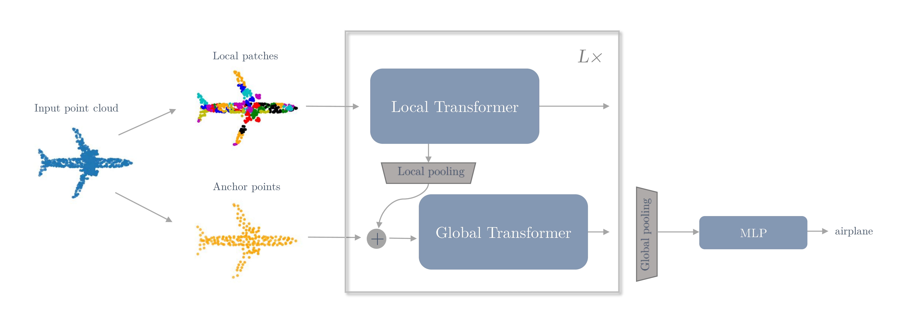

# Point Transformer-in-Transformer




This is the official codebase for the implementation of **[Points to Patches: Enabling the Use of Self-Attention for 3D Shape Recognition](linktoarxiv)**, to be presented at ICPR2022.

We introduce the Point Transformer-in-Transformer (Point-TnT) architecture, which applies self-attention hierarchically on edge features within patches of points, as well as on the patches themselves. This method outperforms the standard Transformer baseline in terms of classification accuracy, while also requiring less computation. This repository contains code for training and evaluating our method, as well as pre-trained models.

Code author: Axel Berg

## Dependencies

Tested using Python 3.6.9 and Pytorch 1.7.0. To install the requirements, run

`pip install -r requirements.txt`

## Datasets

The ScanObjectNN and ModelNet40 datasets will be downloaded automatically and extracted in `./data`, the first time you train a model. For ScanObjectNN, we use the hardest variant (PB_T50_RS), i.e. which is contained in the `*_objectdataset_augmentedrot_scale75.h5` files.

## Training a model

The Point-TnT architecture is defined in `model.py`

To train Point-TnT-3, with the default settings on ScanObjectNN using 1024 points, see `train.sh`, or use the following command

`python main.py --exp_name=test --dataset=scanobjectnn --model=point-tnt --num_points=1024`

The arguments used by Point-TnT are the following:

- `--point_dim`, the embedding dimension of the edge features. Default: `32`
- `--patch_dim`, the embedding dimension of the patch features. Default: `192`
- `--depth`, the number of sequential Transformer blocks. Default: `4`
- `--heads`, the number of self-attention heads. Default: `3`
- `--dim_head`, the embedding dimension of each attention head. Default: `64`
- `--local_attention`, use this to toggle the use of local attention. Default: `True`
- `--global_attention`, use this to toggle the use of global attention. Default: `True`
- `--emb_dims`, the embedding dimension at the final layer. Default: `1023`
- `--n_anchor`, the number of anchor points to use. Default: `192`
- `--k`, the number of nearest neighbours in k-NN graph. Default: `20`

When increasing the number of points in the dataset, the density of the point cloud increases. In order to achieve approximately the same patch size, without increasing the number of nearest neighbours, use the dilation argument `--dilation`. Similarly, the maximum number of erased points used in RSMix augmentation should be increased using `--nsample`. So training with 2048 points should be done as

`python main.py --exp_name=test --dataset=scanobjectnn --model=point-tnt --num_points=2048 --dilation=2 --nsample=1024`

### Note on model cherry-picking :cherries:

During training, the model is evaluated on the test set each epoch, and the model with the highest test accuracy is stored in `model_best.t7` (this is referred to as "Protocol 2" in the paper). Since this method of model selection exploits information from the test set, it is not a good way to measure the generalization performance. Furthermore, the classification results can vary slightly due to randomness in the farthest point sampling method, so the obtained accuracy might not be reproducible anyway. However, since model cherry-picking has been [frequently used in many publications](https://arxiv.org/pdf/2106.05304v1.pdf) on point cloud classification, we include the cherry-picked accuracy to enable comparison.

The model at the final training epoch is stored in `model_final.t7` and we recommend using this one instead.

## Testing a pre-trained model

We provide two pre-trained models, one for each dataset, in `./pretrained`, which can be tested on the corresponding datasets. To run inference, see `eval.sh`, or run

`python main.py --eval --model_path=pretrained/scanobjectnn/model_final.t7 --dataset=scanobjectnn --model=point-tnt --num_points=1024`

Again, results may vary slightly depending on the random seed, due to randomness in farthest point sampling, which is used to select anchor points.

|Model name|Dataset|heads|patch_dim|#params|Accuracy|pre-trained|
|:-:|:-:|:-:|:-:|:-:|:-:|:-:|
|Point-TnT-3|ScanObjectNN|3|192|3.9M|83.5|[here](pretrained/scanobjectnn)|
|Point-TnT-3|ModelNet40|3|192|3.9M|92.6|[here](pretrained/modelnet40)|

## Citation

If you find this work useful, please cite our paper:

````
citation
````

## Acknowledgements

Parts of this repository is based on other people's work, so consider citing their work as well. We thank the authors for sharing their code with the community.

- The RSMix augmentation code is borrowed from https://github.com/dogyoonlee/RSMix-official
- The `farthest_point_sample` method, which is used for selecting anchor points, is borrowed from https://github.com/yanx27/Pointnet_Pointnet2_pytorch
- The `get_graph_feature` method, which is used for extracting edge features between anchor points and their neighbours is the same as in DGCNN: https://github.com/WangYueFt/dgcnn
- Our method is loosely based on this Transformer-in-Transformer implementation: https://github.com/lucidrains/transformer-in-transformer
